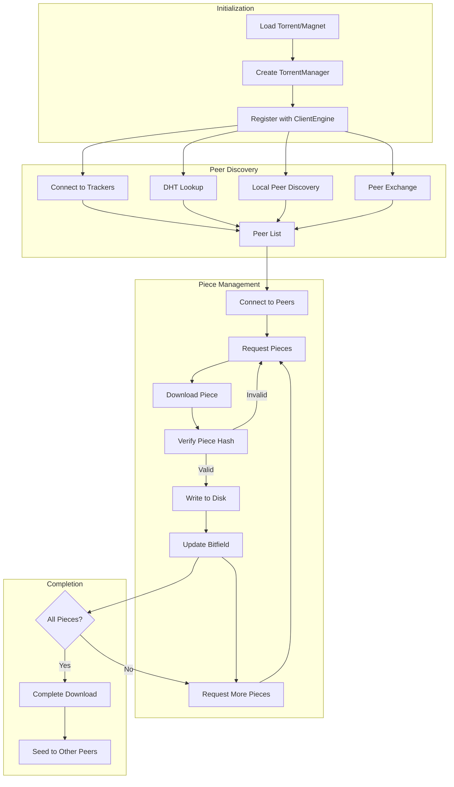

# Data Flow in MonoTorrent

This document describes how data flows through the MonoTorrent library, from initial torrent loading to piece downloading and verification.

## Overall Data Flow

The following diagram illustrates the high-level data flow in MonoTorrent:

## Detailed Data Flow Stages

### 1. Torrent Initialization

1. **Torrent Data Loading**:
   - From a `.torrent` file: Data is parsed using BEncoding parser
   - From a magnet link: Initial metadata is extracted, full metadata downloaded later

2. **TorrentManager Creation**:
   - Torrent metadata is validated
   - File structure is determined
   - Storage is allocated if needed
   - Manager is registered with ClientEngine

3. **Component Initialization**:
   - PieceManager is created to track piece state
   - TrackerManager is initialized with tracker lists
   - PeerManager is set up to handle peer connections
   - Appropriate Mode is set (typically StoppedMode initially)

### 2. Peer Discovery Process

1. **Tracker Announcements**:
   - TrackerManager contacts trackers in tier order
   - Successful responses provide peer lists
   - Failed trackers are retried with exponential backoff

2. **DHT Operation**:
   - DHT engine performs lookup for peers with matching infohash
   - Found peers are added to the peer list
   - Node announcements are done to participate in DHT network

3. **Local Peer Discovery**:
   - Local network is scanned for peers via multicast
   - Discovered peers are added to the peer list

4. **Peer Exchange (PEX)**:
   - Connected peers share their peer lists
   - New peers are added to the candidate list

### 3. Connection and Handshake

1. **Connection Establishment**:
   - ConnectionManager attempts to connect to peers
   - Maximum connections and half-open connection limits are enforced

2. **BitTorrent Handshake**:
   - Protocol handshake exchanges infohashes to verify torrent match
   - BitTorrent extension handshake negotiates supported features
   - Bitfields are exchanged to determine available pieces

3. **Connection Validation**:
   - Connections to peers with no useful pieces may be dropped
   - Connections that violate protocol rules are terminated
   - Connections to banned peers are rejected

### 4. Piece Selection and Download

1. **Piece Selection Logic**:
   - PiecePicker determines which pieces to request next
   - Various strategies may be used (rarest first, sequential, etc.)
   - Request prioritization based on piece availability

2. **Request Management**:
   - PieceManager breaks pieces into blocks (typically 16KB)
   - Requests are sent to peers that have the piece
   - Multiple requests are sent to maximize throughput

3. **Block Reception**:
   - Received blocks are validated and assembled
   - When all blocks in a piece arrive, the piece is complete
   - Rate limiting is applied if configured

### 5. Piece Verification and Storage

1. **Hash Verification**:
   - Each completed piece is hashed using SHA-1
   - Hash is compared to the hash in the torrent metadata
   - Failed pieces are re-requested

2. **Disk Operations**:
   - DiskManager handles writing verified pieces to disk
   - I/O operations are queued and prioritized
   - Disk cache may be used for performance

3. **Bitfield Updates**:
   - Local bitfield is updated to reflect verified pieces
   - "Have" messages are sent to peers
   - Download statistics are updated

### 6. Endgame Mode

1. **Detecting Near Completion**:
   - When few pieces remain, endgame mode may activate
   - PiecePicker switches to EndGamePicker

2. **Request Duplication**:
   - Remaining pieces are requested from multiple peers
   - First successful response is used, others are canceled
   - Prevents slowdown when waiting for final pieces

### 7. Seeding Process

1. **Transition to Seeding**:
   - When all pieces are downloaded, mode changes to SeedingMode
   - Upload-only connections are established

2. **Piece Selection for Upload**:
   - Requests from peers are fulfilled based on choking algorithm
   - Rarest pieces may be prioritized to improve swarm health

3. **Choking Algorithm**:
   - Periodically evaluates which peers to choke/unchoke
   - Based on upload rates and tit-for-tat principles
   - Optimistic unchoking gives chance to new peers

## Event-Driven Communication

MonoTorrent uses events extensively to communicate between components:

1. **TorrentManager Events**:
   - `TorrentStateChanged`: Mode transitions
   - `PieceHashed`: Piece verification results
   - `ConnectionAttemptFailed`: Connection issues

2. **ClientEngine Events**:
   - `CriticalException`: Serious errors
   - `StatsUpdate`: Global statistics

3. **PeerManager Events**:
   - `PeerConnected`: New peer connections
   - `PeerDisconnected`: Peer disconnections

4. **TrackerManager Events**:
   - `AnnounceComplete`: Successful tracker response
   - `AnnounceFailed`: Tracker failures

## Performance Considerations

Several mechanisms ensure efficient data flow:

1. **Connection Throttling**:
   - Maximum connections limit prevents resource exhaustion
   - Connection attempt throttling prevents network flooding

2. **Rate Limiting**:
   - Upload/download rate limiting at global and per-torrent levels
   - Token bucket algorithm for smooth rate control

3. **Request Pipelining**:
   - Multiple outstanding requests per peer
   - Optimized request sizes (typically 16KB blocks)

4. **Disk I/O Optimization**:
   - Read/write operations are queued and batched
   - Optional disk cache for frequent operations
   - Asynchronous I/O for non-blocking operation

5. **Memory Management**:
   - Buffer pooling to reduce allocations
   - Efficient data structures for large torrent support

## Error Handling and Recovery

The data flow includes several error recovery mechanisms:

1. **Connection Failures**:
   - Failed connections are retried with backoff
   - Alternative peers are tried if available

2. **Piece Hash Failures**:
   - Failed pieces are re-requested from different peers
   - Peers sending bad data may be banned

3. **Tracker Failures**:
   - Failed trackers are retried with exponential backoff
   - Alternative trackers are used from the same tier

4. **Disk I/O Errors**:
   - Failed write operations are retried
   - Critical disk errors are propagated to the application

## Conclusion

MonoTorrent's data flow is designed to be efficient, robust, and scalable. The architecture allows for high throughput while maintaining resource efficiency and providing ample error recovery mechanisms. The event-driven design enables components to communicate state changes without tight coupling, facilitating extensibility and customization.