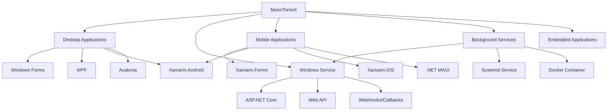

# Integration Patterns for MonoTorrent

This document outlines common patterns for integrating MonoTorrent into different types of applications.

## Overview

MonoTorrent can be integrated into various application types including desktop applications, web services, mobile apps (via Xamarin/.NET MAUI), and background services. Each integration pattern addresses specific use cases and has unique considerations.



## Desktop Application Integration

### Key Considerations

1. **UI Responsiveness**: BitTorrent operations must not block the UI thread
2. **Progress Reporting**: Provide clear progress indicators to the user
3. **Configuration**: Allow users to configure key BitTorrent parameters
4. **Resource Management**: Monitor and limit resource usage
5. **Persistence**: Save/restore session state between application launches

### Recommended Pattern: MVVM with Async Operations

```csharp
// ViewModel with async operations
public class TorrentViewModel : INotifyPropertyChanged
{
    private readonly ClientEngine engine;
    private readonly TorrentManager manager;
    private readonly Timer updateTimer;
    private double progress;
    
    public double Progress
    {
        get => progress;
        set
        {
            progress = value;
            OnPropertyChanged();
        }
    }
    
    // Other properties for speed, state, etc.
    
    public TorrentViewModel(ClientEngine engine, TorrentManager manager)
    {
        this.engine = engine;
        this.manager = manager;
        
        // Set up timer to update UI properties
        updateTimer = new Timer(UpdateState, null, 0, 1000);
        
        // Subscribe to events for important state changes
        manager.TorrentStateChanged += OnTorrentStateChanged;
    }
    
    private void UpdateState(object state)
    {
        // Update UI properties
        Progress = manager.Progress;
        // Update other properties...
    }
    
    private void OnTorrentStateChanged(object sender, TorrentStateChangedEventArgs e)
    {
        // Handle significant state changes
        if (e.NewState == TorrentState.Seeding && e.OldState == TorrentState.Downloading)
        {
            // Download completed
            NotifyDownloadComplete();
        }
    }
    
    public async Task StartAsync()
    {
        await manager.StartAsync();
    }
    
    public async Task StopAsync()
    {
        await manager.StopAsync();
    }
    
    // Implement INotifyPropertyChanged
    public event PropertyChangedEventHandler PropertyChanged;
    
    protected virtual void OnPropertyChanged([CallerMemberName] string propertyName = null)
    {
        PropertyChanged?.Invoke(this, new PropertyChangedEventArgs(propertyName));
    }
}
```

### Example: WPF Application

```xaml
<Window x:Class="TorrentApp.MainWindow"
        xmlns="http://schemas.microsoft.com/winfx/2006/xaml/presentation"
        xmlns:x="http://schemas.microsoft.com/winfx/2006/xaml"
        Title="MonoTorrent Client" Height="450" Width="800">
    <Grid>
        <ListView ItemsSource="{Binding Torrents}">
            <ListView.ItemTemplate>
                <DataTemplate>
                    <Grid>
                        <Grid.ColumnDefinitions>
                            <ColumnDefinition Width="*"/>
                            <ColumnDefinition Width="100"/>
                            <ColumnDefinition Width="100"/>
                            <ColumnDefinition Width="100"/>
                        </Grid.ColumnDefinitions>
                        
                        <TextBlock Grid.Column="0" Text="{Binding Name}"/>
                        <ProgressBar Grid.Column="1" Value="{Binding Progress}" Maximum="100"/>
                        <TextBlock Grid.Column="2" Text="{Binding State}"/>
                        <StackPanel Grid.Column="3" Orientation="Horizontal">
                            <Button Content="Start" Command="{Binding StartCommand}"/>
                            <Button Content="Stop" Command="{Binding StopCommand}"/>
                        </StackPanel>
                    </Grid>
                </DataTemplate>
            </ListView.ItemTemplate>
        </ListView>
    </Grid>
</Window>
```

### Best Practices for Desktop Integration

1. **Use Asynchronous Methods**: Always use async versions of MonoTorrent methods
2. **Background Processing**: Handle long-running operations in background
3. **UI Updates**: Use timers or events to update UI elements
4. **Error Handling**: Provide clear error messages to the user
5. **Resource Cleanup**: Properly dispose engine and managers on application exit

## Web Service Integration

### Key Considerations

1. **State Management**: BitTorrent state must persist across HTTP requests
2. **Resource Limitations**: Web servers may have restrictions on disk/network
3. **Progress Reporting**: Push or pull mechanisms for status updates
4. **Authentication**: Secure access to torrent operations
5. **Scaling**: Handle multiple users/torrents efficiently

### Recommended Pattern: Singleton Engine with Background Service

```csharp
// Singleton service to manage torrents
public class TorrentService : IHostedService, IDisposable
{
    private static readonly object syncLock = new object();
    private ClientEngine engine;
    private Dictionary<string, TorrentManager> torrents = new Dictionary<string, TorrentManager>();
    
    public TorrentService()
    {
        // Initialize engine with appropriate settings
        var settings = new EngineSettings
        {
            MaximumDownloadRate = 2 * 1024 * 1024, // 2 MB/s
            MaximumUploadRate = 512 * 1024         // 512 KB/s
        };
        
        engine = new ClientEngine(settings);
    }
    
    public async Task<string> AddTorrentAsync(Stream torrentStream, string downloadDirectory)
    {
        var torrent = await Torrent.LoadAsync(torrentStream);
        var manager = await engine.AddAsync(torrent, downloadDirectory);
        
        lock (syncLock)
        {
            string id = Guid.NewGuid().ToString();
            torrents.Add(id, manager);
            return id;
        }
    }
    
    public async Task StartTorrentAsync(string id)
    {
        if (torrents.TryGetValue(id, out var manager))
        {
            await manager.StartAsync();
        }
        else
        {
            throw new KeyNotFoundException($"Torrent with ID {id} not found");
        }
    }
    
    public TorrentStatus GetTorrentStatus(string id)
    {
        if (torrents.TryGetValue(id, out var manager))
        {
            return new TorrentStatus
            {
                Id = id,
                Name = manager.Torrent?.Name ?? manager.InfoHash.ToHex(),
                Progress = manager.Progress,
                State = manager.State.ToString(),
                DownloadSpeed = manager.Monitor.DownloadRate,
                UploadSpeed = manager.Monitor.UploadRate
            };
        }
        
        throw new KeyNotFoundException($"Torrent with ID {id} not found");
    }
    
    public async Task StartAsync(CancellationToken cancellationToken)
    {
        // Load saved torrents, etc.
        return Task.CompletedTask;
    }
    
    public async Task StopAsync(CancellationToken cancellationToken)
    {
        // Stop all torrents
        await engine.StopAllAsync();
        
        // Save state for all torrents
        // ...
    }
    
    public void Dispose()
    {
        engine.Dispose();
    }
}

// Status DTO
public class TorrentStatus
{
    public string Id { get; set; }
    public string Name { get; set; }
    public double Progress { get; set; }
    public string State { get; set; }
    public long DownloadSpeed { get; set; }
    public long UploadSpeed { get; set; }
}

// Controller
[ApiController]
[Route("api/[controller]")]
public class TorrentController : ControllerBase
{
    private readonly TorrentService torrentService;
    
    public TorrentController(TorrentService torrentService)
    {
        this.torrentService = torrentService;
    }
    
    [HttpPost]
    public async Task<IActionResult> AddTorrent(IFormFile torrentFile)
    {
        using var stream = torrentFile.OpenReadStream();
        string id = await torrentService.AddTorrentAsync(stream, "/downloads");
        return Ok(new { Id = id });
    }
    
    [HttpPost("{id}/start")]
    public async Task<IActionResult> StartTorrent(string id)
    {
        await torrentService.StartTorrentAsync(id);
        return Ok();
    }
    
    [HttpGet("{id}")]
    public IActionResult GetStatus(string id)
    {
        var status = torrentService.GetTorrentStatus(id);
        return Ok(status);
    }
}
```

### Real-time Updates with SignalR

For real-time updates, integrate SignalR:

```csharp
// Hub for real-time updates
public class TorrentHub : Hub
{
    // Clients can join groups based on torrent IDs
    public async Task JoinTorrentGroup(string torrentId)
    {
        await Groups.AddToGroupAsync(Context.ConnectionId, torrentId);
    }
}

// Modified service to send updates
public class TorrentService : IHostedService, IDisposable
{
    private readonly IHubContext<TorrentHub> hubContext;
    private Timer statusUpdateTimer;
    
    public TorrentService(IHubContext<TorrentHub> hubContext)
    {
        this.hubContext = hubContext;
    }
    
    public async Task StartAsync(CancellationToken cancellationToken)
    {
        // Set up timer to send status updates
        statusUpdateTimer = new Timer(SendStatusUpdates, null, TimeSpan.Zero, TimeSpan.FromSeconds(1));
        return Task.CompletedTask;
    }
    
    private async void SendStatusUpdates(object state)
    {
        foreach (var entry in torrents)
        {
            var status = GetTorrentStatus(entry.Key);
            await hubContext.Clients.Group(entry.Key).SendAsync("TorrentStatusUpdate", status);
        }
    }
    
    // Rest of the service...
}
```

### Best Practices for Web Service Integration

1. **Singleton Engine**: Use a single engine instance managed as a service
2. **Thread Safety**: Ensure thread-safe access to shared resources
3. **Throttling**: Apply rate limits to prevent resource exhaustion
4. **Persistence**: Regularly save state to enable service restarts
5. **Authentication**: Secure API endpoints with proper authentication
6. **CORS**: Configure CORS for web clients if needed
7. **Monitoring**: Add health checks and monitoring for the service

## Background Service Integration

### Key Considerations

1. **Minimal UI**: Typically runs without direct user interaction
2. **Resource Management**: Careful control of CPU, memory, and bandwidth
3. **Fault Tolerance**: Automatic recovery from errors
4. **Configuration**: External configuration without UI
5. **Logging**: Comprehensive logging for troubleshooting

### Recommended Pattern: Worker Service with Dependency Injection

```csharp
// Program.cs
public class Program
{
    public static void Main(string[] args)
    {
        CreateHostBuilder(args).Build().Run();
    }
    
    public static IHostBuilder CreateHostBuilder(string[] args) =>
        Host.CreateDefaultBuilder(args)
            .UseSystemd() // For Linux
            .UseWindowsService() // For Windows
            .ConfigureServices((hostContext, services) =>
            {
                // Configure MonoTorrent engine
                services.AddSingleton<ClientEngine>(sp => {
                    var config = sp.GetRequiredService<IConfiguration>();
                    var settings = new EngineSettings
                    {
                        MaximumDownloadRate = config.GetValue<int>("BitTorrent:MaxDownloadRate"),
                        MaximumUploadRate = config.GetValue<int>("BitTorrent:MaxUploadRate"),
                        ListenPort = config.GetValue<int>("BitTorrent:ListenPort")
                    };
                    return new ClientEngine(settings);
                });
                
                // Add torrent service
                services.AddSingleton<TorrentService>();
                
                // Add worker
                services.AddHostedService<TorrentWorker>();
            });
}

// Worker implementation
public class TorrentWorker : BackgroundService
{
    private readonly ILogger<TorrentWorker> logger;
    private readonly TorrentService torrentService;
    private readonly IConfiguration configuration;
    
    public TorrentWorker(
        ILogger<TorrentWorker> logger,
        TorrentService torrentService,
        IConfiguration configuration)
    {
        this.logger = logger;
        this.torrentService = torrentService;
        this.configuration = configuration;
    }
    
    protected override async Task ExecuteAsync(CancellationToken stoppingToken)
    {
        logger.LogInformation("Torrent service starting");
        
        // Load initial torrents from configuration
        var watchDirectory = configuration.GetValue<string>("BitTorrent:WatchDirectory");
        Directory.CreateDirectory(watchDirectory);
        
        // Set up file watcher for new torrents
        var watcher = new FileSystemWatcher(watchDirectory, "*.torrent");
        watcher.Created += OnTorrentFileCreated;
        watcher.EnableRaisingEvents = true;
        
        // Load existing torrents
        foreach (var file in Directory.GetFiles(watchDirectory, "*.torrent"))
        {
            await AddTorrentFromFileAsync(file);
        }
        
        // Keep the service running
        while (!stoppingToken.IsCancellationRequested)
        {
            await Task.Delay(TimeSpan.FromMinutes(1), stoppingToken);
            
            // Periodic maintenance
            LogActiveTorrents();
        }
    }
    
    private async void OnTorrentFileCreated(object sender, FileSystemEventArgs e)
    {
        logger.LogInformation($"New torrent file detected: {e.Name}");
        await AddTorrentFromFileAsync(e.FullPath);
    }
    
    private async Task AddTorrentFromFileAsync(string path)
    {
        try
        {
            using var stream = File.OpenRead(path);
            var downloadDirectory = configuration.GetValue<string>("BitTorrent:DownloadDirectory");
            string id = await torrentService.AddTorrentAsync(stream, downloadDirectory);
            await torrentService.StartTorrentAsync(id);
            logger.LogInformation($"Started torrent: {id}");
        }
        catch (Exception ex)
        {
            logger.LogError(ex, $"Error adding torrent file: {path}");
        }
    }
    
    private void LogActiveTorrents()
    {
        try
        {
            var stats = torrentService.GetGlobalStats();
            logger.LogInformation(
                $"Active torrents: {stats.TorrentCount}, " +
                $"Download: {stats.DownloadRate / 1024:F2} KB/s, " +
                $"Upload: {stats.UploadRate / 1024:F2} KB/s");
        }
        catch (Exception ex)
        {
            logger.LogError(ex, "Error logging torrent statistics");
        }
    }
}
```

### Best Practices for Background Services

1. **Configuration**: Use configuration files for all settings
2. **Logging**: Implement comprehensive, structured logging
3. **Resource Control**: Set resource limits based on system capabilities
4. **Process Lifetime**: Handle service start/stop gracefully
5. **Monitoring**: Implement health checks and alerting
6. **Error Recovery**: Use retry policies for transient errors
7. **Storage Management**: Implement automated cleanup of completed torrents

## Mobile Application Integration

### Key Considerations

1. **Battery Usage**: Minimize background operations to save battery
2. **Data Usage**: Respect user's data limits and WiFi preferences
3. **Background Limitations**: Handle OS restrictions on background processes
4. **Storage Considerations**: Mobile devices often have limited storage
5. **Intermittent Connectivity**: Handle connection changes gracefully

### Recommended Pattern: Limited Operation with Background Tasks

```csharp
// Xamarin/MAUI implementation
public class MobileTorrentService
{
    private readonly ClientEngine engine;
    private readonly Dictionary<string, TorrentManager> torrents = new Dictionary<string, TorrentManager>();
    private readonly IPreferences preferences;
    private readonly IConnectivity connectivity;
    
    public MobileTorrentService(IPreferences preferences, IConnectivity connectivity)
    {
        this.preferences = preferences;
        this.connectivity = connectivity;
        
        // Configure engine with mobile-friendly defaults
        var settings = new EngineSettings
        {
            MaximumDownloadRate = 512 * 1024,    // 512 KB/s
            MaximumUploadRate = 128 * 1024,      // 128 KB/s
            MaximumConnections = 60,             // Reduced connections
            AllowedEncryption = EncryptionTypes.All
        };
        
        engine = new ClientEngine(settings);
        
        // Monitor connection changes
        connectivity.ConnectivityChanged += OnConnectivityChanged;
    }
    
    private void OnConnectivityChanged(object sender, ConnectivityChangedEventArgs e)
    {
        // Check if we should continue based on settings
        bool wifiOnly = preferences.Get("WifiOnly", false);
        
        if (wifiOnly && connectivity.NetworkAccess == NetworkAccess.Internet &&
            connectivity.ConnectionProfiles.Contains(ConnectionProfile.WiFi))
        {
            // Resume torrents on WiFi
            ResumeAllTorrents();
        }
        else if (wifiOnly || connectivity.NetworkAccess != NetworkAccess.Internet)
        {
            // Pause torrents when not on WiFi or no connection
            PauseAllTorrents();
        }
    }
    
    private async void ResumeAllTorrents()
    {
        foreach (var manager in torrents.Values)
        {
            if (manager.State == TorrentState.Paused)
            {
                await manager.StartAsync();
            }
        }
    }
    
    private async void PauseAllTorrents()
    {
        foreach (var manager in torrents.Values)
        {
            if (manager.State == TorrentState.Downloading || manager.State == TorrentState.Seeding)
            {
                await manager.PauseAsync();
            }
        }
    }
    
    // Rest of the implementation...
}

// Background task registration (platform-specific)
#if ANDROID
[Activity(Label = "TorrentApp")]
public class MainActivity : MauiAppCompatActivity
{
    protected override void OnCreate(Bundle savedInstanceState)
    {
        base.OnCreate(savedInstanceState);
        
        // Register background work
        var workRequest = new PeriodicWorkRequest.Builder(
            typeof(TorrentUpdateWorker), 
            TimeSpan.FromMinutes(15))
            .Build();
            
        WorkManager.Instance.EnqueueUniquePeriodicWork(
            "TorrentUpdate",
            ExistingPeriodicWorkPolicy.Keep,
            workRequest);
    }
}

// Background worker
public class TorrentUpdateWorker : Worker
{
    public TorrentUpdateWorker(Context context, WorkerParameters workerParams)
        : base(context, workerParams)
    {
    }
    
    public override Result DoWork()
    {
        // Update torrents, check for completions, etc.
        // ...
        return Result.Success();
    }
}
#endif
```

### Best Practices for Mobile Integration

1. **Respect User Settings**: Consider battery, data, and storage preferences
2. **Adaptive Operation**: Adjust behavior based on connectivity and power
3. **Background Limitations**: Be aware of platform-specific background restrictions
4. **Storage Awareness**: Monitor available storage and pause if low
5. **UI Responsiveness**: Keep the UI responsive even during intensive operations
6. **Battery Optimization**: Batch operations and reduce wake cycles
7. **Offline Operation**: Queue operations for when connectivity is restored

## Embedded Application Integration

### Key Considerations

1. **Resource Constraints**: Limited CPU, memory, and storage
2. **Network Capabilities**: Often limited bandwidth or intermittent
3. **Power Considerations**: May run on battery or limited power
4. **Reliability**: Need to operate without manual intervention
5. **Remote Management**: Often managed remotely without direct UI

### Recommended Pattern: Minimalist Integration with Resource Controls

```csharp
// Simplified engine configuration for embedded devices
public class EmbeddedTorrentClient
{
    private readonly ClientEngine engine;
    private readonly string storageDirectory;
    private readonly ILogger logger;
    
    public EmbeddedTorrentClient(string storageDirectory, ILogger logger)
    {
        this.storageDirectory = storageDirectory;
        this.logger = logger;
        
        // Very conservative settings for embedded devices
        var settings = new EngineSettings
        {
            MaximumDownloadRate = 256 * 1024,    // 256 KB/s
            MaximumUploadRate = 64 * 1024,       // 64 KB/s
            MaximumConnections = 30,             // Limited connections
            MaximumOpenFiles = 10,               // Limited file handles
            DiskCacheBytes = 1 * 1024 * 1024     // 1 MB disk cache
        };
        
        engine = new ClientEngine(settings);
    }
    
    public async Task DownloadTorrentAsync(byte[] torrentData)
    {
        try
        {
            // Check available storage before proceeding
            if (!HasSufficientStorage())
            {
                logger.LogError("Insufficient storage for download");
                return;
            }
            
            // Load torrent
            var torrent = await Torrent.LoadAsync(torrentData);
            
            // Add and start
            var manager = await engine.AddAsync(torrent, storageDirectory);
            await manager.StartAsync();
            
            // Monitor for completion
            manager.TorrentStateChanged += (s, e) => {
                if (e.NewState == TorrentState.Seeding && e.OldState == TorrentState.Downloading)
                {
                    logger.LogInformation($"Download complete: {torrent.Name}");
                    // Perform any post-download processing
                    ProcessCompletedDownload(manager);
                }
            };
        }
        catch (Exception ex)
        {
            logger.LogError(ex, "Error downloading torrent");
        }
    }
    
    private bool HasSufficientStorage()
    {
        try
        {
            // Platform-specific storage check
            var driveInfo = new DriveInfo(Path.GetPathRoot(storageDirectory));
            // Require at least 100 MB free
            return driveInfo.AvailableFreeSpace > 100 * 1024 * 1024;
        }
        catch
        {
            // If we can't check, assume not enough
            return false;
        }
    }
    
    private void ProcessCompletedDownload(TorrentManager manager)
    {
        // Application-specific processing
        // e.g., Extract files, verify integrity, etc.
    }
    
    public void Shutdown()
    {
        engine.Dispose();
    }
}
```

### Best Practices for Embedded Integration

1. **Resource Monitoring**: Continuously monitor resource usage
2. **Conservative Limits**: Set very conservative bandwidth and connection limits
3. **Storage Checking**: Verify sufficient storage before operations
4. **Error Recovery**: Implement robust error recovery mechanisms
5. **Remote Administration**: Provide remote management capabilities
6. **Logging**: Log all significant events for remote troubleshooting
7. **Automatic Management**: Implement automatic cleanup of completed torrents

## Performance Considerations Across All Patterns

Regardless of the integration pattern, consider these performance aspects:

1. **Memory Management**: MonoTorrent can consume substantial memory with many active torrents
2. **File Handles**: Be aware of file handle limits, especially on servers
3. **Disk I/O**: BitTorrent operations are disk I/O intensive
4. **Network Capacity**: Set appropriate rate limits based on available bandwidth
5. **CPU Usage**: Piece verification and encryption can be CPU-intensive
6. **Parallelism**: Use Task-based asynchronous operations for better resource utilization

## Conclusion

MonoTorrent's flexible architecture allows for integration with many application types. By following the appropriate patterns and best practices for your specific scenario, you can create robust, efficient BitTorrent-enabled applications.

Key takeaways:

1. Use asynchronous operations throughout
2. Configure resource limits appropriately for your environment
3. Implement proper error handling and recovery
4. Consider persistence and state management
5. Apply appropriate UI patterns for your application type

Each integration pattern involves trade-offs between functionality, performance, and resource usage. Choose the pattern that best fits your specific requirements and constraints.