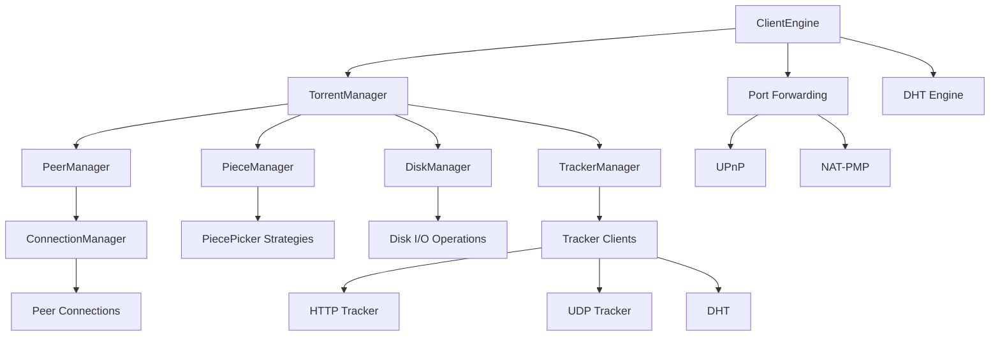

# MonoTorrent Architecture Overview

MonoTorrent is a comprehensive BitTorrent client library written in C#. It provides a complete implementation of the BitTorrent protocol and related technologies, allowing developers to incorporate BitTorrent functionality into their applications.

## High-Level Architecture

MonoTorrent follows a modular design with clear separation of concerns. The architecture consists of several key components that work together to provide the full functionality of a BitTorrent client.

## Core Components

### ClientEngine

The central component that manages all torrents and provides global settings and services. It's responsible for:
- Managing multiple torrent downloads/uploads
- Global rate limiting
- Connection management
- Port forwarding
- DHT coordination

### TorrentManager

Manages the downloading/seeding of a single torrent. Each torrent is controlled by its own TorrentManager instance, which coordinates:
- The current state (mode) of the torrent
- Piece selection and validation
- Tracker communication
- Peer management
- Disk operations for the torrent

### Modes

MonoTorrent uses the State pattern to manage different torrent states through Mode classes:
- **StoppedMode**: When the torrent is not active
- **DownloadMode**: When downloading torrent data
- **MetadataMode**: When downloading only the torrent metadata
- **HashingMode**: When verifying downloaded data
- **SeedingMode**: When uploading to peers after download completion

### PeerManager

Handles peer discovery and management, including:
- Maintaining the list of known peers
- Establishing connections with peers
- Handling peer messages
- Managing peer states

### DiskManager

Responsible for all disk I/O operations:
- Reading and writing torrent pieces
- Checking piece hashes
- Managing file allocation
- Implementing read/write queuing

### PieceManager & PiecePickers

These components decide which pieces to request from peers:
- **StandardPicker**: Regular sequential downloading
- **RarestFirstPicker**: Prioritizes the rarest pieces in the swarm
- **PriorityPicker**: Downloads pieces based on file priority
- **EndGamePicker**: Used when nearing download completion

### TrackerManager

Coordinates communication with BitTorrent trackers:
- Announcing the client's status
- Receiving peer lists
- Managing multiple trackers and tracker tiers
- Handling tracker failures and retries

### DHT Implementation

Provides trackerless operation through the Distributed Hash Table protocol:
- Peer discovery without centralized trackers
- Distributed storage of peer information
- Implementation of Kademlia algorithm

## Protocol Support

MonoTorrent implements the core BitTorrent protocol (BEP 3) along with numerous extensions:
- Metadata exchange (BEP 9)
- Peer exchange (BEP 11)
- DHT (BEP 5)
- Fast peers extension (BEP 6)
- IPv6 support
- UPnP and NAT-PMP port forwarding
- Local peer discovery
- Streaming support
- BitTorrent v2 support

## Design Principles

MonoTorrent's architecture adheres to several key design principles:

1. **Modularity**: Components are designed with single responsibilities and clean interfaces
2. **Extensibility**: Key components use interfaces and abstract classes to enable custom implementations
3. **Event-driven communication**: Changes in state are communicated through .NET events
4. **Asynchronous operations**: I/O-bound operations use async/await patterns for performance
5. **Resource efficiency**: Careful management of memory and network resources

## Conclusion

MonoTorrent provides a robust, modular architecture that implements the complete BitTorrent specification and numerous extensions. Its design allows for flexibility in how it's integrated into applications while maintaining high performance and resource efficiency.