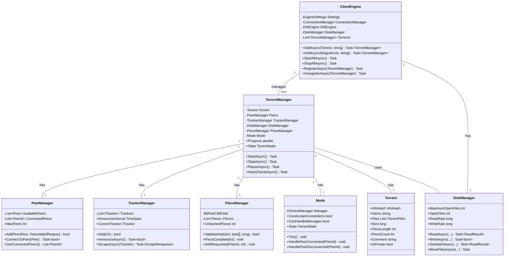
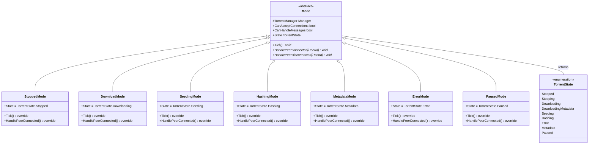
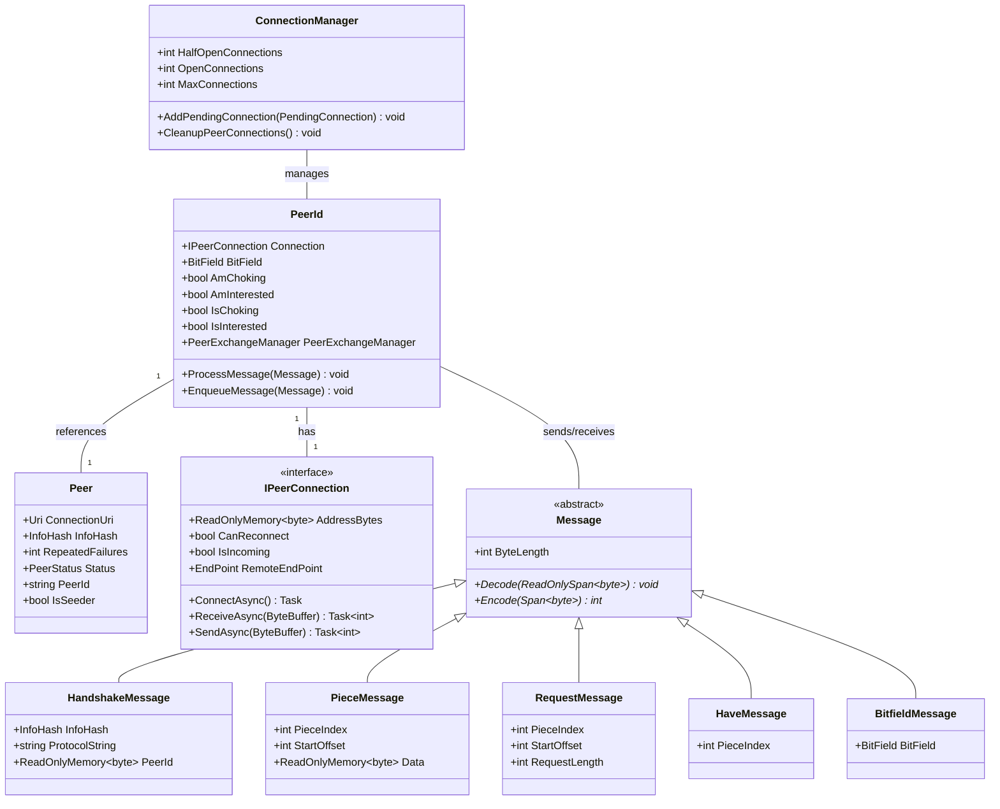
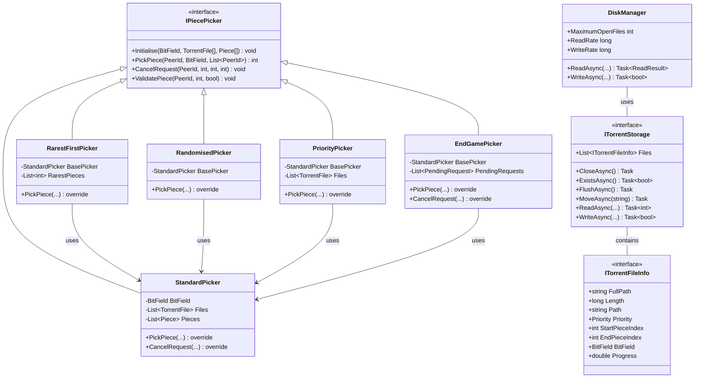
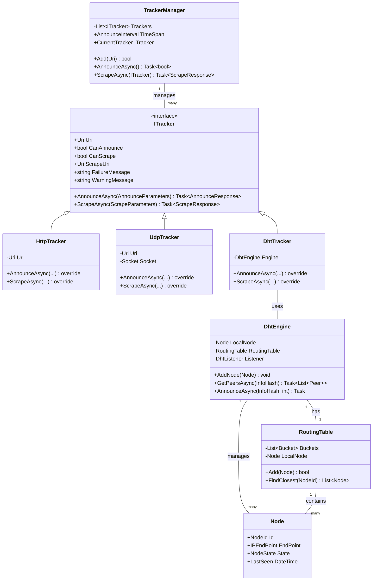
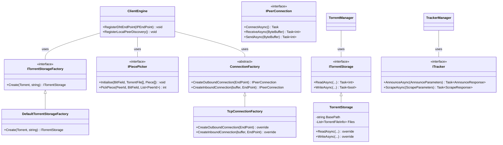

# MonoTorrent Core Component Diagrams

This document contains UML diagrams representing the core architecture of MonoTorrent.

## Client Engine and Torrent Manager Relationship

The following diagram shows the relationship between the main components of MonoTorrent:

## Torrent States and Modes

This diagram illustrates the relationship between the `TorrentState` enum and the various `Mode` implementations:

## Peer Communication Classes

This diagram shows the classes involved in peer communication:

## Piece Picking and Storage Hierarchy

This diagram shows the piece picking strategies and storage interfaces:

## Tracker and DHT Classes

This diagram shows the tracker and DHT components:

## Extension Points Diagram

This diagram illustrates the main extension points in MonoTorrent:

These diagrams provide a comprehensive view of MonoTorrent's architecture and component relationships.