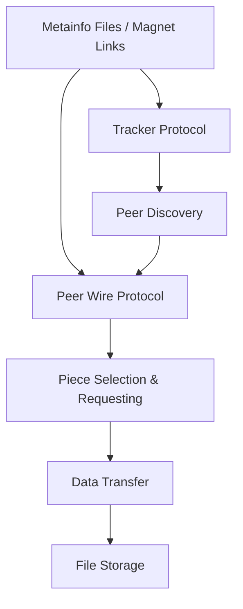
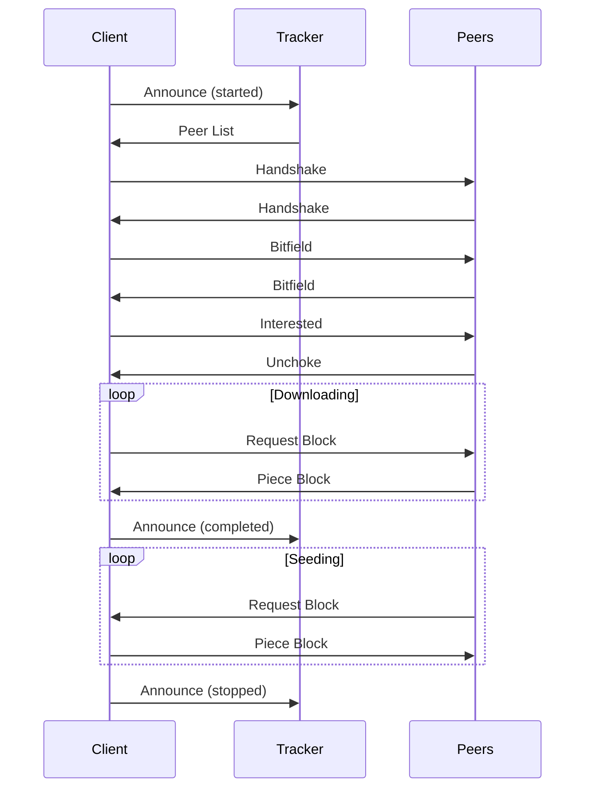

# BitTorrent Protocol Overview

This document provides a technical overview of the BitTorrent protocol as implemented in MonoTorrent.

## Introduction to BitTorrent

BitTorrent is a peer-to-peer (P2P) file sharing protocol designed for efficient distribution of large files. Unlike traditional client-server models, BitTorrent distributes the sharing load among all users downloading the file, with each peer uploading content to other peers while downloading.

Key concepts in BitTorrent:

- **Peer**: Any client participating in a torrent
- **Seeder**: A peer that has the complete file and is only uploading
- **Leecher**: A peer that is still downloading the file
- **Swarm**: The collection of all peers sharing a torrent
- **Tracker**: A server that coordinates peers in a swarm
- **Piece**: A fixed-size portion of the file being shared
- **Block**: A sub-division of a piece that is the actual unit of transfer
- **Torrent File**: Contains metadata about the files being shared
- **Info Hash**: A unique identifier for the torrent, calculated from the metadata

## Protocol Layers

The BitTorrent protocol can be divided into several layers:



### 1. Metainfo (.torrent) Files

The .torrent file is a bencoded dictionary containing:

- **info**: Dictionary containing file information
  - **name**: Suggested name for the file/directory
  - **piece length**: Size of each piece in bytes
  - **pieces**: Concatenated SHA-1 hashes of each piece
  - **length** (for single-file torrents): Size of the file in bytes
  - **files** (for multi-file torrents): List of dictionaries, each with:
    - **length**: Size of the file in bytes
    - **path**: List of strings representing the file path

- **announce**: URL of the primary tracker
- **announce-list**: (Optional) List of tracker tiers
- **creation date**: (Optional) Unix timestamp of creation time
- **comment**: (Optional) Free-form comment
- **created by**: (Optional) Name/version of the program used to create the torrent

#### BEncoding Format

BEncoding is a simple, lightweight serialization format used by BitTorrent:

- **Strings**: `<length>:<string>` (e.g., `5:hello`)
- **Integers**: `i<number>e` (e.g., `i42e`)
- **Lists**: `l<bencoded values>e` (e.g., `l5:helloi42ee`)
- **Dictionaries**: `d<bencoded key><bencoded value>...e` (e.g., `d3:foo3:bar5:helloi42ee`)

### 2. Magnet Links

Magnet links provide a way to reference a torrent without the .torrent file. They use the URI scheme `magnet:?` followed by parameters:

- **xt**: Exact Topic - contains the info hash (e.g., `xt=urn:btih:HASH`)
- **dn**: Display Name - suggested name (optional)
- **tr**: Tracker URL (optional, can be multiple)

Example:
```
magnet:?xt=urn:btih:A47B37D5560CF21D510E22A414E47B4B38004D7E&dn=Ubuntu+20.04&tr=http%3A%2F%2Ftracker.example.org%2Fannounce
```

### 3. Tracker Protocol

Trackers help peers find each other using a simple HTTP-based protocol:

#### Tracker Request

HTTP GET request with parameters:
- **info_hash**: 20-byte SHA-1 hash of the info dictionary
- **peer_id**: 20-byte string identifying the client
- **port**: Port the client is listening on
- **uploaded**: Total bytes uploaded
- **downloaded**: Total bytes downloaded
- **left**: Bytes left to download
- **compact**: Whether to use compact peer format (1 or 0)
- **event**: One of "started", "completed", "stopped" (optional)

#### Tracker Response

BEncoded dictionary containing:
- **interval**: Seconds between requests
- **peers**: List of peers (either as dictionaries or compact format)
- **complete**: Number of seeders (optional)
- **incomplete**: Number of leechers (optional)

#### UDP Tracker Protocol

A more efficient binary protocol alternative to HTTP tracking:
1. Connection Establishment (8-byte connection ID)
2. Announce Request (containing the same information as HTTP)
3. Announce Response (containing peers and stats)

### 4. Peer Wire Protocol

The peer wire protocol defines how peers communicate:

#### Handshake

The first message exchanged between peers:
```
<pstrlen><pstr><reserved><info_hash><peer_id>
```
- **pstrlen**: Length of the protocol string (1 byte, value 19)
- **pstr**: Protocol string ("BitTorrent protocol")
- **reserved**: 8 bytes for flags indicating extensions
- **info_hash**: 20-byte SHA-1 hash of the info dictionary
- **peer_id**: 20-byte client identifier

#### Messages

After the handshake, messages follow this format:
```
<length prefix><message ID><payload>
```
- **length prefix**: 4-byte integer specifying payload length
- **message ID**: 1-byte message type
- **payload**: Message data (variable length)

Standard message types:
- **0**: Choke
- **1**: Unchoke
- **2**: Interested
- **3**: Not Interested
- **4**: Have
- **5**: Bitfield
- **6**: Request
- **7**: Piece
- **8**: Cancel
- **9**: Port (DHT)

#### Extensions

BitTorrent has been extended with many features, implemented as protocol extensions:

- **Fast Extension** (BEP 6): Allows for faster connection startup and end game
- **Extension Protocol** (BEP 10): A framework for negotiating extensions
- **Metadata Exchange** (BEP 9): Allows downloading .torrent metadata from peers
- **Peer Exchange (PEX)**: Allows peers to exchange known peers
- **Encryption**: Provides basic obfuscation of BitTorrent traffic

### 5. DHT Protocol

The Distributed Hash Table allows for trackerless operation:

- Based on Kademlia DHT
- Each node has a NodeID in the same space as info hashes
- Peers store location information for info hashes
- Operations include:
  - **ping**: Check if a node is active
  - **find_node**: Find nodes close to a target ID
  - **get_peers**: Find peers for an info hash
  - **announce_peer**: Announce as a peer for an info hash

## Key BitTorrent Enhancement Proposals (BEPs)

MonoTorrent implements many BitTorrent Enhancement Proposals (BEPs):

- **BEP 3**: The BitTorrent Protocol Specification
- **BEP 5**: DHT Protocol
- **BEP 6**: Fast Extension
- **BEP 7**: IPv6 Tracker Extension
- **BEP 9**: Extension for Peers to Send Metadata Files
- **BEP 10**: Extension Protocol
- **BEP 11**: Peer Exchange (PEX)
- **BEP 12**: Multitracker Metadata Extension
- **BEP 14**: Local Service Discovery
- **BEP 15**: UDP Tracker Protocol
- **BEP 19**: WebSeed - HTTP/FTP Seeding
- **BEP 23**: Tracker Returns Compact Peer Lists
- **BEP 27**: Private Torrents
- **BEP 52**: The BitTorrent Protocol v2

## Piece Selection Strategies

Efficient piece selection is critical for BitTorrent performance:

### Strict Priority

The primary goal is to complete pieces as quickly as possible:
1. Once a block from a piece is requested, the remaining blocks from that piece get highest priority
2. This ensures pieces are completed quickly

### Rarest First

The default piece selection policy:
1. Request pieces that are the least common among connected peers
2. Improves piece distribution in the swarm
3. Helps rare pieces propagate more quickly

### Random First Piece

For the very first piece:
1. Choose a piece at random instead of rarest
2. Allows starting a download as quickly as possible

### Endgame Mode

When approaching completion:
1. Request all remaining blocks from multiple peers
2. Send cancellations when blocks are received
3. Prevents slowdowns waiting for the last few blocks

### Streaming Selection

For media streaming:
1. Download pieces sequentially from the playback point
2. Balance between sequential download and rarest first
3. Ensure smooth playback while maintaining good swarm health

## Choking Algorithm

BitTorrent's "tit-for-tat" incentive mechanism:

1. **Regular Unchoke**: Every 10 seconds, unchoke the 4 peers with best upload rates
2. **Optimistic Unchoke**: Every 30 seconds, unchoke one random peer
3. **Anti-Snubbing**: If a peer hasn't sent data for 60 seconds, assume it's "snubbing" and avoid it
4. **Upload Only Mode**: Seeders use a different algorithm focusing on peers with highest download rates

## Protocol Message Flow

The sequence of events for a typical BitTorrent session:



## Advanced Protocol Features

### WebSeeds (BEP 19)

Allows torrents to supplement peer-to-peer transfers with HTTP sources:
- Helps with seeding rare content
- Provides initial seeds for new torrents
- Implemented as URLs in the .torrent file's "url-list" field

### Private Torrents (BEP 27)

Restricts peer discovery to tracker only:
- Sets a "private" flag in the info dictionary
- Disables DHT, PEX, and LSD
- Used for private tracker communities

### BitTorrent v2 (BEP 52)

Major protocol update:
- Uses SHA-256 instead of SHA-1 for hashing
- Per-file piece hashing for integrity
- Merkle trees for efficient verification
- Backward compatible with v1 (hybrid torrents)

### Local Peer Discovery

Finds peers on the local network:
- Uses multicast to announce presence
- Low latency connections with local peers
- Higher bandwidth between local peers

## Implementation in MonoTorrent

MonoTorrent implements the BitTorrent protocol with:

1. **Full Specification Compliance**: Adheres to core BEPs
2. **Modularity**: Components are cleanly separated
3. **Asynchronous Design**: Non-blocking I/O for performance
4. **Extension Support**: Implements major protocol extensions
5. **Cross-Platform**: Works on any platform supporting .NET

Key implementation classes:
- **TorrentManager**: Coordinates the protocol for a single torrent
- **PeerManager**: Manages peer connections and messaging
- **PieceManager**: Handles piece selection and verification
- **DiskManager**: Manages file I/O operations
- **TrackerManager**: Coordinates tracker communication
- **DhtEngine**: Implements the DHT protocol

## Protocol Performance Considerations

### Message Batching

Grouping related messages reduces overhead:
- Combine multiple Have messages
- Batch Request messages
- Group PEX peer exchanges

### Request Pipelining

Keep multiple requests in flight:
- Default is 5 pending requests per peer
- Adjusted based on peer performance
- Critical for high-latency connections

### Disk I/O Optimization

Efficient disk operations:
- Read-ahead buffer for frequently accessed data
- Write caching for pieces
- Asynchronous I/O to prevent blocking

### Connection Management

Smart connection handling:
- Limit connections based on system resources
- Prioritize connections to peers with unique pieces
- Drop slow or unresponsive peers

## Debugging BitTorrent

When troubleshooting BitTorrent issues:

1. **Protocol Messages**: Examine raw protocol messages
2. **Tracker Communication**: Check tracker requests and responses
3. **Peer Behavior**: Monitor peer message patterns
4. **Piece Selection**: Review piece request patterns
5. **Disk Operations**: Verify disk read/write performance

MonoTorrent provides extensive logging capabilities to help with debugging these aspects.

## Security Considerations

While using the BitTorrent protocol:

1. **Content Verification**: Verify piece hashes to ensure integrity
2. **Private Torrents**: Use private flag for controlled distribution
3. **Encryption**: Enable protocol encryption for basic privacy
4. **IP Filtering**: Filter known malicious peers
5. **Port Selection**: Choose non-default ports to avoid blanket filtering

## Conclusion

The BitTorrent protocol is a robust, scalable solution for distributing large files. MonoTorrent provides a comprehensive implementation of the protocol, including most major extensions, with a clean, modular architecture that makes it easy to integrate into .NET applications.

For more detailed information on specific aspects of the protocol, refer to the official BEPs or the MonoTorrent source code.